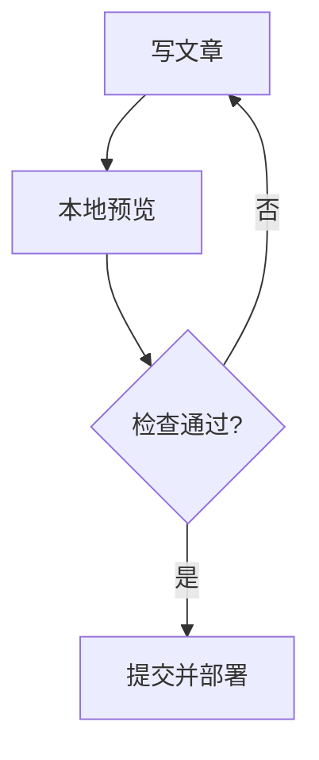
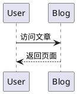

# Firefly Astro 博客主题完整上手指南：从安装、写作到部署与个性化配置

> 本文基于 Firefly Docs 中文站整理与改写，面向想要搭建个人博客、技术博客、图文记录站或二次元风格内容站的用户。文章不是官方文档的逐字复制，而是一篇可直接发布的介绍型长文，帮助读者快速理解 Firefly 的定位、功能、配置方式与日常维护流程。

## 一、Firefly 是什么？

Firefly 是一款基于 Astro 框架开发的现代化个人博客主题模板。它的整体风格清新、轻量、可定制，适合技术爱好者、内容创作者、二次元用户、摄影记录者和希望拥有独立内容阵地的个人站长。

与很多只提供基础文章列表的博客模板不同，Firefly 更像是一套完整的内容型站点方案。它不仅能写 Markdown 文章，还提供导航栏、双侧边栏、个人资料卡、音乐播放器、评论系统、相册、友链、赞助页面、公告、广告位、文章加密、Live2D / Spine 看板娘、樱花特效、Mermaid 图表、PlantUML 图表、KaTeX 数学公式等模块。

从使用体验上看，Firefly 的核心特点可以概括为四点：

1. **配置集中**：大多数功能都集中在 `src/config/` 目录中，通过修改 TypeScript 配置文件即可完成站点个性化。
2. **内容友好**：文章使用 Markdown / MDX 编写，适合长期维护技术笔记、教程、随笔、图文记录等内容。
3. **视觉丰富**：支持壁纸模式、卡片样式、主题色、双侧边栏、音乐和动画特效，让个人站点不只是“文章仓库”。
4. **部署灵活**：构建产物是静态文件，可部署到 Vercel、Netlify、GitHub Pages、Cloudflare Pages、EdgeOne Pages、阿里云 ESA 或自有服务器。

## 二、适合哪些人使用？

Firefly 特别适合以下几类用户：

- 想用 Astro 搭建现代静态博客，但不想从零设计主题的人。
- 想把技术文章、生活记录、摄影相册、友链、赞助入口整合在一个站点里的人。
- 喜欢高度自定义页面外观，包括主题色、壁纸、侧边栏、音乐播放器和看板娘的人。
- 需要 Markdown、MDX、数学公式、图表、代码块高亮等写作能力的技术作者。
- 希望把博客托管到免费静态平台，并通过 Git 自动部署的人。

如果你的目标只是写极简文本，Firefly 可能功能偏多；但如果你想做一个有“个人空间感”的博客，它的配置体系会很合适。

## 三、环境要求与安装流程

开始之前，建议准备好以下环境：

| 工具 | 建议版本 / 说明 |
|---|---|
| Node.js | 22.0 或更高版本 |
| pnpm | 推荐使用的包管理器 |
| Git | 用于克隆仓库、版本管理和后续更新 |

### 1. 克隆项目

```bash
git clone https://github.com/CuteLeaf/Firefly.git
cd Firefly
```

### 2. 安装依赖

```bash
pnpm install
```

### 3. 启动本地开发服务器

```bash
pnpm dev
```

启动后即可在本地浏览器中预览站点。此时你可以一边修改配置和文章，一边实时查看效果。

### 4. 构建生产版本

```bash
pnpm build
```

构建成功后，静态产物会输出到 `dist/` 目录。部署到服务器或静态托管平台时，通常只需要上传或发布这个目录中的内容。

## 四、项目结构速览

Firefly 的目录结构比较清晰，常见目录如下：

```text
Firefly/
├── src/
│   ├── config/        # 站点、导航、侧边栏、评论、音乐等配置
│   ├── components/    # 主题组件
│   ├── content/       # 文章与特殊页面内容
│   ├── layouts/       # 页面布局模板
│   ├── pages/         # Astro 页面路由
│   └── types/         # 类型定义
├── public/            # 静态资源，例如图片、音乐、模型、图标等
└── astro.config.mjs   # Astro 项目配置
```

普通用户最常改动的目录主要是：

- `src/content/posts/`：放博客文章。
- `src/content/spec/`：放某些特殊页面的自定义内容，例如友链页底部内容。
- `src/config/`：修改站点功能和外观。
- `public/`：放不会经过构建优化的静态资源，例如部分图片、音乐文件、模型文件。

## 五、如何写文章？

Firefly 的文章默认放在：

```text
src/content/posts/
```

你可以直接放 `.md` 或 `.mdx` 文件，也可以使用子目录来管理文章资源。例如：

```text
src/content/posts/
├── my-first-post.md
├── astro-notes/
│   ├── cover.webp
│   └── index.md
└── frontend/
    └── css-layout.md
```

这种结构适合把文章正文和封面、插图放在同一个目录下，便于迁移和维护。

### 1. Frontmatter 基础写法

每篇文章顶部都需要使用 YAML Frontmatter 描述文章信息：

```yaml
---
title: 我的第一篇 Firefly 文章
published: 2026-06-10
description: 记录一次使用 Firefly 搭建博客的过程
image: ./cover.webp
tags: [Astro, 博客, 前端]
category: 博客建设
draft: false
---
```

常用字段说明如下：

| 字段 | 作用 | 建议 |
|---|---|---|
| `title` | 文章标题 | 必填，尽量清晰具体 |
| `published` | 发布日期 | 必填，建议使用 `YYYY-MM-DD` |
| `updated` | 更新日期 | 文章大改后再填写 |
| `description` | 摘要 | 会影响首页卡片和 SEO 展示 |
| `image` | 封面图 | 可用相对路径、public 路径、网络图或 `api` |
| `tags` | 标签 | 适合多维度检索 |
| `category` | 分类 | 建议一个文章只放入一个主分类 |
| `draft` | 是否草稿 | 草稿不会对读者显示 |
| `slug` | 自定义 URL | 发布后不要频繁修改 |
| `author` | 作者 | 多作者站点可使用 |
| `comment` | 是否开启评论 | 单篇文章可单独关闭 |
| `password` | 文章密码 | 用于加密私密文章 |
| `passwordHint` | 密码提示 | 给读者提示，但不要泄露密码 |

### 2. 封面图片的选择

`image` 字段支持几类写法：

```yaml
image: ./cover.webp
```

```yaml
image: /assets/images/cover.webp
```

```yaml
image: https://example.com/cover.webp
```

```yaml
image: api
```

如果使用 `api`，需要先在 `src/config/coverImageConfig.ts` 中配置随机封面图 API。实际使用时，建议优先使用本地压缩后的图片，保证访问稳定性和加载速度。

### 3. 自定义文章 URL

默认情况下，文章 URL 通常与文件名有关。如果想让链接更短、更适合 SEO，可以使用 `slug`：

```yaml
---
title: Firefly 使用心得
slug: firefly-blog-guide
---
```

建议 slug 使用英文小写、数字和连字符，例如：

```text
firefly-blog-guide
astro-static-blog
my-2026-reading-list
```

不要在发布后频繁修改 slug，否则可能影响外链、搜索引擎收录和旧链接访问。

### 4. 草稿文章

当文章还没写完时，可以设置：

```yaml
draft: true
```

发布前再改为：

```yaml
draft: false
```

这样可以把未完成内容留在仓库中，而不会显示给读者。

## 六、Markdown、MDX 与增强写作能力

Firefly 支持标准 Markdown，也支持 MDX。一般文章推荐使用 `.md`，当你需要导入组件、写 JSX 或使用动态变量时，再使用 `.mdx`。

### 1. 数学公式

Firefly 内置 KaTeX 渲染能力，适合写数学、算法、机器学习、物理或工程类文章。

行内公式示例：

```markdown
欧拉公式 $e^{i\pi}+1=0$ 被称为数学中非常优美的公式。
```

块级公式示例：

```markdown
$$
\int_{-\infty}^{\infty}e^{-x^2}dx=\sqrt{\pi}
$$
```

### 2. Mermaid 图表

Mermaid 适合在文章中写流程图、时序图、状态图、甘特图、类图等。使用方式是在代码块中指定 `mermaid`：

````markdown

````

这对技术教程、项目复盘、系统设计说明尤其有用。

### 3. PlantUML 图表

如果你更习惯 PlantUML，可以在 `src/config/plantumlConfig.ts` 中管理相关配置。PlantUML 适合写 UML 时序图、类图、组件图等内容。

````markdown

````

对于公开内容，可以使用默认服务；如果图表包含内部架构或敏感信息，建议自建 PlantUML 服务。

### 4. 提醒框

Firefly 支持常见的提醒框语法，可以用来突出提示、警告、重要信息等。

```markdown
> [!NOTE]
> 这是一条提示信息。

> [!WARNING]
> 修改配置后可能需要重启开发服务器。
```

提醒框主题可在站点配置中调整，例如 GitHub、Obsidian 或 VitePress 风格。

### 5. 嵌入视频与外部内容

文章中可以直接嵌入 iframe，例如 YouTube 或 Bilibili 视频。建议注意以下几点：

- 控制 iframe 宽高，避免移动端布局溢出。
- 尽量关闭自动播放，避免影响阅读体验。
- 外部视频可能受网络环境影响，必要时提供备用链接。

### 6. MDX 使用建议

MDX 允许你在文章中导入组件，例如图标、卡片、交互组件等。它更强大，但维护成本也更高。建议规则是：

- 普通文章、教程、笔记：使用 `.md`。
- 需要组件、动态变量、复杂排版：使用 `.mdx`。
- 长期归档内容：尽量减少过度组件化，降低迁移成本。

## 七、核心配置文件概览

Firefly 的可配置能力很强，常见配置文件如下：

| 配置文件 | 主要作用 |
|---|---|
| `siteConfig.ts` | 站点标题、描述、主题色、页面开关、文章布局等全局配置 |
| `navBarConfig.ts` | 顶部导航栏链接与搜索配置 |
| `sidebarConfig.ts` | 左右侧边栏、移动端底部组件配置 |
| `profileConfig.ts` | 个人资料卡片、头像、社交链接 |
| `backgroundWallpaper.ts` | 背景壁纸、横幅、全屏、透明模式 |
| `commentConfig.ts` | Twikoo、Waline、Giscus、Disqus、Artalk 等评论系统 |
| `musicConfig.ts` | 音乐播放器与播放源配置 |
| `fontConfig.ts` | CDN 字体、本地字体、回退字体 |
| `coverImageConfig.ts` | 文章封面图和随机封面 API |
| `expressiveCodeConfig.ts` | 代码块主题、折叠、语言徽章 |
| `effectsConfig.ts` | 樱花特效等动画效果 |
| `announcementConfig.ts` | 侧边栏公告组件 |
| `footerConfig.ts` | 页脚 HTML 注入 |
| `licenseConfig.ts` | 文章版权 / 许可证信息 |
| `friendsConfig.ts` | 友情链接页面 |
| `sponsorConfig.ts` | 赞助页面和赞助者列表 |
| `adConfig.ts` | 侧边栏广告位 |
| `pioConfig.ts` | Live2D / Spine 看板娘模型 |

建议新用户先从 `siteConfig.ts`、`profileConfig.ts`、`navBarConfig.ts` 和文章目录开始，等基础站点能正常运行后，再逐步开启评论、音乐、相册、特效等功能。

## 八、站点配置：打造博客的基本身份

`src/config/siteConfig.ts` 是 Firefly 的核心配置之一。它决定站点标题、语言、主题色、页面开关、文章列表样式等基础行为。

### 1. 基础信息

常见字段包括：

```ts
export const siteConfig = {
  title: "我的博客",
  subtitle: "记录技术、生活与灵感",
  site_url: "https://example.com",
  description: "一个使用 Firefly 和 Astro 构建的个人博客",
  keywords: ["Astro", "博客", "前端", "Firefly"],
  lang: "zh_CN",
};
```

这些信息不仅会显示在页面中，也会影响 SEO、分享卡片和浏览器标题。上线前务必把 `site_url` 改成真实域名。

### 2. 主题色与显示模式

Firefly 使用色相值控制主题色，例如：

- 红色附近：`0`
- 青色附近：`200`
- 蓝紫色附近：`250`
- 粉色附近：`345`

你还可以设置默认显示模式：

```ts
themeColor: {
  hue: 165,
  fixed: false,
  defaultMode: "system",
}
```

如果希望读者不能修改主题色，可以将 `fixed` 设为 `true`。

### 3. 页面宽度与卡片样式

`pageWidth` 决定整体内容最大宽度。文章多、侧边栏多的站点可以适当增大；偏阅读型博客可以保持克制，避免正文行宽过长。

卡片样式可以控制是否开启边框、阴影，以及浅色模式下是否跟随主题色。建议个人站点可以开启一些视觉层次，但技术文档型站点要以阅读效率优先。

### 4. 页面开关

Firefly 提供了多个页面开关，例如友链、赞助、留言板、番组计划等。对于不需要的模块，建议直接关闭，减少导航复杂度。

```ts
pages: {
  friends: true,
  sponsor: true,
  guestbook: true,
  bangumi: false,
}
```

页面开关会影响导航栏展示。比如关闭赞助页面后，相关导航链接不会继续显示。

### 5. 文章列表布局

文章列表支持列表和网格模式，还能控制标签显示、摘要行数、是否允许访客切换布局等。内容密集型博客适合列表模式；图片较多或生活记录型博客可尝试网格模式。

## 九、导航栏配置：让读者快速找到内容

导航栏由 `src/config/navBarConfig.ts` 管理。Firefly 提供了一些预设链接，例如首页、归档、关于、友链、赞助、留言板、番组计划等。

你可以混合使用预设链接和自定义链接：

```ts
const links = [
  LinkPreset.Home,
  LinkPreset.Archive,
  {
    name: "项目",
    url: "/projects/",
    icon: "material-symbols:work-outline",
  },
  {
    name: "GitHub",
    url: "https://github.com/your-name",
    external: true,
    icon: "fa7-brands:github",
  },
];
```

自定义链接支持子菜单，适合把 GitHub、Bilibili、项目主页、资源站等整理在一个入口下。

### 搜索功能

Firefly 的导航栏搜索使用单独配置。默认方案是 PageFind，适合静态博客的全文搜索需求。上线后如果发现搜索不到新文章，通常需要重新构建并部署站点。

### 图标建议

已预装的图标集包括常见品牌图标和 Material Symbols。为了避免包体积增加，建议优先使用已安装图标集；确实需要其他图标集时，再额外安装。

## 十、侧边栏配置：信息密度与阅读体验的平衡

侧边栏由 `src/config/sidebarConfig.ts` 控制。Firefly 支持左侧、右侧或双侧栏布局。可用组件包括：

| 组件类型 | 用途 |
|---|---|
| `profile` | 个人资料卡 |
| `announcement` | 公告 |
| `music` | 音乐播放器 |
| `categories` | 分类列表 |
| `tags` | 标签云 |
| `stats` | 站点统计 |
| `calendar` | 日历 |
| `sidebarToc` | 文章目录 |
| `advertisement` | 广告位 |

一个比较实用的布局是：

- 左侧：个人资料、公告、音乐、分类、标签。
- 右侧：站点统计、日历、文章目录。
- 移动端：只保留最重要的组件，避免页面过长。

建议不要把所有组件都打开。博客的核心是内容，侧边栏应服务于导航、识别作者和增强氛围，而不是抢走正文注意力。

## 十一、个人资料卡：建立站点识别度

`src/config/profileConfig.ts` 控制头像、名字、签名和社交链接。

头像路径可使用：

- `public` 目录路径，例如 `/assets/images/avatar.webp`。
- `src` 目录路径，例如 `assets/images/avatar.avif`，通常可以获得构建优化。
- 远程 URL，例如头像 CDN 链接。

示例配置：

```ts
export const profileConfig = {
  avatar: "assets/images/avatar.avif",
  name: "你的名字",
  bio: "写代码，也写生活。",
  links: [
    { name: "GitHub", icon: "fa7-brands:github", url: "https://github.com/your-name" },
    { name: "Email", icon: "fa7-solid:envelope", url: "mailto:you@example.com" },
    { name: "RSS", icon: "fa7-solid:rss", url: "/rss/" },
  ],
};
```

个人资料卡建议保持简洁。头像、名字、签名和两三个主要链接就足够了。

## 十二、背景壁纸：从简洁到沉浸式

背景壁纸由 `src/config/backgroundWallpaper.ts` 控制，支持多种模式：

| 模式 | 适合场景 |
|---|---|
| `banner` | 首页横幅，适合大多数博客 |
| `fullscreen` | 全屏背景，适合视觉型个人主页 |
| `overlay` | 全屏透明背景，适合强调氛围感 |
| `none` | 纯色背景，适合极简阅读型站点 |

图片可以分别设置桌面端和移动端，也可以配置多张图随机显示，或者使用随机图 API。

实际建议：

- 技术博客：使用 `banner` 或 `none`，保证正文可读性。
- 图文 / 二次元博客：使用 `banner` 或 `overlay`，增强视觉风格。
- 移动端：使用单独压缩过的竖图，避免加载大尺寸桌面壁纸。
- 性能优先：关闭可切换模式，只渲染固定模式。

背景配置还可以控制首页标题、打字机效果、导航栏透明度、毛玻璃模糊、水波纹动画和渐变过渡。水波纹等动画会影响性能，建议按需开启。

## 十三、字体配置：美观与性能之间取舍

`src/config/fontConfig.ts` 控制自定义字体。Firefly 支持 CDN 字体和本地字体。

常见配置项包括：

- `enable`：是否启用自定义字体。
- `preload`：是否预加载字体。
- `selected`：当前选择的字体 ID，可配置多个字体组合。
- `fallback`：字体回退列表。

建议优先使用 CDN 字体，加载和缓存更方便；如果使用本地字体，最好做字体子集化，否则中文字体文件可能非常大，影响首屏速度。

对于中文博客，字体选择建议：

- 正文优先考虑可读性，不要过度花哨。
- 标题可以稍有个性，但不要影响识别。
- 备选字体列表要包含系统字体，避免加载失败时页面异常。

## 十四、代码块配置：让技术文章更好读

Firefly 的代码块基于 Expressive Code，支持亮色 / 暗色主题、长代码折叠、语言徽章等能力。配置文件是：

```text
src/config/expressiveCodeConfig.ts
```

常见配置思路：

- 暗色主题用于夜间模式，亮色主题用于白天模式。
- 长代码块超过一定行数自动折叠，减少页面滚动压力。
- 开启语言徽章，让读者一眼知道代码语言。

技术博客建议开启长代码折叠。教程文章中，完整配置文件可能很长，如果全部展开，会打断阅读节奏。

## 十五、评论系统：让静态博客拥有互动能力

Firefly 支持多种评论系统：

| 评论系统 | 特点 |
|---|---|
| Twikoo | 简洁、常见于静态博客，支持访问量等功能 |
| Waline | 功能完整，可支持匿名与登录模式 |
| Giscus | 基于 GitHub Discussions，适合开发者博客 |
| Disqus | 第三方托管评论平台，国际化较常见 |
| Artalk | 自托管评论系统，适合重视数据掌控的用户 |

评论配置在 `src/config/commentConfig.ts` 中。只需把 `type` 设置为对应名称即可启用，设为 `none` 则关闭评论。

选择建议：

- 面向开发者：优先考虑 Giscus，读者有 GitHub 账号时体验较好。
- 面向中文个人博客：Twikoo 或 Waline 较常见。
- 希望完全自托管：可以考虑 Artalk。
- 只想安静写作：关闭评论，使用邮件或留言板作为反馈渠道。

## 十六、封面图片与随机封面

`src/config/coverImageConfig.ts` 控制文章详情页是否显示封面图，以及是否启用随机封面。

如果随机封面开启，文章 Frontmatter 中可以写：

```yaml
image: api
```

系统会按配置尝试随机图 API，如果全部失败，则使用 fallback 图片。建议为所有随机图功能准备稳定的备用图，避免页面出现空白或加载失败。

封面图实践建议：

- 技术教程使用简洁封面，不要喧宾夺主。
- 生活记录或相册类文章可以使用照片封面。
- 所有封面图尽量使用 WebP / AVIF，并控制体积。
- 避免使用不稳定的第三方图床作为唯一图片来源。

## 十七、文章加密：保护私密内容

Firefly 支持通过文章 Frontmatter 添加密码来加密正文：

```yaml
---
title: 私密记录
published: 2026-06-10
password: "your-strong-password"
passwordHint: "提示语"
---
```

加密文章的正文会在构建时处理，访客需要输入密码后才能在浏览器端解密。适合用于：

- 私密随笔。
- 只给朋友看的旅行记录。
- 不想公开搜索收录的资料页。
- 需要临时分享但不想完全公开的内容。

注意：密码强度非常重要。由于加密后的内容仍会随页面发布，弱密码存在被暴力破解的风险。不要把高敏感数据、账号密码、密钥等内容仅依赖博客文章加密保存。

## 十八、音乐播放器：营造个人空间氛围

Firefly 内置音乐播放器，配置文件为：

```text
src/config/musicConfig.ts
```

它支持两种模式：

1. **Meting API 模式**：通过在线音乐平台的歌单、专辑、单曲或搜索结果加载音乐。
2. **本地音乐模式**：直接引用 `public` 目录中的音频、封面和歌词文件。

常见配置项包括默认音量、播放模式、是否显示歌词、是否在导航栏显示入口等。

使用建议：

- 默认音量不要过大。
- 不建议自动播放，避免打扰读者。
- 使用本地音乐时注意版权和文件体积。
- 如果站点偏技术文档风格，可以只在侧边栏保留入口，避免过强干扰。

## 十九、友链页面：建立博客之间的连接

友链配置在 `src/config/friendsConfig.ts` 中。每个友链通常包含：

- 站点名称。
- 头像或 Logo。
- 简短描述。
- 站点地址。
- 标签。
- 权重。
- 是否启用。

友链页面还支持底部自定义 MDX 内容，文件路径通常是：

```text
src/content/spec/friends.mdx
```

你可以在这里写友链申请说明、本站信息、交换要求、维护规则等。建议友链页面保持友好但明确，例如说明：

- 请先添加本站链接。
- 长期无法访问的站点可能会被移除。
- 不接受违法、采集、恶意跳转或低质量内容站点。

## 二十、相册页面：让图片内容更有组织

Firefly 的相册功能采用两级结构：相册首页展示所有相册卡片，点击后进入相册详情页。照片放在：

```text
public/gallery/{album-id}/
```

例如：

```text
public/gallery/tokyo-2026/
├── cover.webp
├── 01.webp
├── 02.webp
└── 03.webp
```

相册元信息在 `src/config/galleryConfig.ts` 中配置，例如相册名称、描述、地点、日期、标签等。

封面图优先级通常可以按以下逻辑理解：

1. 手动配置的封面图。
2. 目录中的 `cover.*` 文件。
3. 文件名排序后的第一张图片。

相册适合用于旅行记录、摄影作品、活动照片、插画归档等。建议提前统一图片尺寸和压缩策略，避免一次性加载过多大图。

## 二十一、赞助页面：为长期创作提供支持入口

赞助配置在 `src/config/sponsorConfig.ts` 中，可以配置：

- 页面标题和描述。
- 赞助用途说明。
- 是否展示赞助者列表。
- 是否在文章底部显示赞助按钮。
- 支付方式、二维码或外部赞助链接。

常见赞助方式包括支付宝、微信、Ko-fi、爱发电等。使用时要注意：

- 清楚说明赞助用途。
- 不要误导读者认为赞助会影响内容客观性。
- 如果公开赞助者名单，确认对方是否同意展示名称和金额。

## 二十二、公告、广告与页脚

### 1. 公告

公告配置在 `src/config/announcementConfig.ts` 中，通常显示在侧边栏。适合放：

- 站点迁移通知。
- 内容更新计划。
- 维护说明。
- 重要活动入口。

公告可以设置图标、类型、链接和是否可关闭。是否显示公告组件由侧边栏配置控制。

### 2. 广告

广告配置在 `src/config/adConfig.ts` 中，支持图片广告、文字广告、链接、关闭按钮、显示次数限制和过期时间。

如果只是个人博客，也可以把广告位当作“推荐卡片”，例如推荐自己的开源项目、微信公众号、赞助入口或新文章合集。

建议广告不要过多。广告位应当清楚、可关闭、不遮挡正文。

### 3. 页脚

页脚配置支持注入自定义 HTML，常用于备案号、版权说明、站点运行信息等。配置文件包括：

```text
src/config/footerConfig.ts
src/config/FooterConfig.html
```

如果你的网站面向中国大陆访问，并使用了需要备案的域名，可以在页脚加入备案号链接。

## 二十三、许可证配置：明确内容使用边界

Firefly 支持在文章顶部或相关区域显示许可证信息。配置文件是：

```text
src/config/licenseConfig.ts
```

常见许可证包括：

| 许可证 | 含义 |
|---|---|
| CC BY 4.0 | 署名 |
| CC BY-SA 4.0 | 署名，相同方式共享 |
| CC BY-NC 4.0 | 署名，非商业性使用 |
| CC BY-NC-SA 4.0 | 署名，非商业性使用，相同方式共享 |
| CC BY-ND 4.0 | 署名，禁止演绎 |
| CC BY-NC-ND 4.0 | 署名，非商业性使用，禁止演绎 |

建议个人博客明确内容许可，尤其是技术教程、摄影作品、原创文章和可转载内容。不同文章也可以通过 Frontmatter 覆盖默认许可证。

## 二十四、樱花特效：适度增加氛围感

Firefly 的特效配置目前包括樱花飘落动画，配置文件是：

```text
src/config/effectsConfig.ts
```

可以控制：

- 是否启用。
- 是否允许用户切换。
- 樱花数量。
- 尺寸范围。
- 不透明度范围。
- 横向、纵向、旋转和淡出速度。
- z-index 层级。

建议：

- 内容型博客不宜默认开启过强动画。
- 可以允许用户在设置面板中自行切换。
- 移动端和低性能设备上要谨慎使用。

## 二十五、Live2D / Spine 看板娘

Firefly 支持 Live2D 或 Spine 模型，配置文件是：

```text
src/config/pioConfig.ts
```

两者可以二选一使用。

### 1. Spine 模型

Spine 配置可以控制模型路径、缩放、坐标偏移、显示位置、容器尺寸、点击动画、点击文案、待机动画、移动端隐藏和透明度等。

适合希望放置小尺寸互动角色，但不需要复杂菜单的场景。

### 2. Live2D 模型

Live2D 使用组件实现，支持模型路径、音量、缩放、位置、入场动画、菜单项、提示气泡、多个模型切换、移动端隐藏等。

使用建议：

- 模型放在左下角通常更安全，因为右下角可能遮挡返回顶部按钮。
- 移动端默认隐藏，避免遮挡内容和增加性能负担。
- 模型资源要注意版权，不要随意使用未授权角色素材。

## 二十六、部署指南：把 Firefly 发布到线上

Firefly 构建后是静态站点，因此部署方式很灵活。

### 1. 本地构建后上传

如果你使用自己的服务器，例如 Nginx 或 Apache，可以本地构建：

```bash
pnpm build
```

然后将 `dist/` 目录中的文件上传到服务器站点目录。

### 2. Vercel

Vercel 对 Astro 项目支持较好。常见配置：

| 配置项 | 值 |
|---|---|
| Framework Preset | Astro |
| Build Command | `pnpm build` |
| Output Directory | `dist` |
| Install Command | `pnpm install` |
| Node.js Version | 22.x |

### 3. Netlify

Netlify 的配置也比较简单：

| 配置项 | 值 |
|---|---|
| Build command | `pnpm build` |
| Publish directory | `dist` |
| Environment variable | `NODE_VERSION=22` |

也可以使用 `netlify.toml` 固化配置。

### 4. GitHub Pages

GitHub Pages 适合开源博客。通常流程是：

1. 在仓库设置中启用 GitHub Actions 作为 Pages 来源。
2. 添加构建和部署 workflow。
3. 使用 Node 22 和 pnpm 安装依赖。
4. 构建后上传 `dist`。
5. 部署到 GitHub Pages。

如果部署到 `https://username.github.io/repo-name/`，需要在 Astro 配置中正确设置 `site` 和 `base`。如果使用自定义域名或仓库名就是 `username.github.io`，通常不需要额外设置 `base`。

### 5. Cloudflare Workers / Pages

Cloudflare Workers 和 Cloudflare Pages 都可以部署静态站点。Pages 更像传统静态托管，Workers 更适合边缘函数和静态资源结合。

常见配置：

- 构建命令：`pnpm build`
- 输出目录：`dist`
- Node 版本：22

使用 Wrangler CLI 时，可以先安装并登录 Wrangler，再执行构建和部署命令。

### 6. EdgeOne Pages 与阿里云 ESA

如果主要读者在中国大陆，EdgeOne Pages 和阿里云 ESA 这类边缘静态托管也值得考虑。一般流程是连接 Git 仓库，配置 Astro、构建命令、输出目录和 Node 版本，然后自动部署。

### 7. 自定义域名

大多数平台绑定自定义域名的流程相似：

1. 在 DNS 服务商添加 CNAME 或平台要求的解析记录。
2. 在部署平台添加自定义域名。
3. 等待 DNS 生效。
4. 启用 HTTPS。
5. 在站点配置中把 `site_url` 改为正式域名。

上线后建议检查：

- 首页能否访问。
- 文章详情页能否访问。
- RSS、站点地图、搜索是否正常。
- 静态资源路径是否正确。
- 分享卡片和 OpenGraph 信息是否正确。

## 二十七、更新主题：如何减少冲突

Firefly 主题后续更新时，推荐优先使用 Git 合并方式。

### 1. 添加上游仓库

```bash
git remote add upstream https://github.com/CuteLeaf/Firefly.git
```

### 2. 拉取更新

```bash
git fetch upstream
```

### 3. 合并主题更新

```bash
git merge upstream/master
```

如果出现冲突，通常是你改动了主题核心文件或配置文件。解决冲突后再提交即可。

为了降低后续更新难度，建议遵守一个原则：

> 尽量只修改 `src/config/`、`src/content/` 和 `public/`，不要直接修改主题核心组件。

如果你做了大量深度定制，Git 合并可能冲突较多。此时也可以手动备份配置和内容，下载新版本后再把自定义内容迁移过去。

更新后建议依次检查：

- 配置文件是否新增必填项。
- TypeScript 是否报错。
- 依赖是否需要重新安装。
- `pnpm dev` 本地预览是否正常。
- `pnpm build` 是否能成功构建。
- 主要页面、文章、评论、相册、音乐和模型是否正常。

## 二十八、推荐的新站初始化步骤

如果你是第一次使用 Firefly，可以按这个顺序配置：

1. 克隆项目并安装依赖。
2. 修改 `siteConfig.ts` 中的站点名称、描述、域名、语言和主题色。
3. 修改 `profileConfig.ts` 中的头像、名字、签名和社交链接。
4. 修改 `navBarConfig.ts`，只保留真正需要的导航入口。
5. 决定侧边栏布局，先少开组件，再逐步增加。
6. 添加第一篇文章，确认 Frontmatter、封面和标签正常。
7. 配置评论系统，或先关闭评论。
8. 配置部署平台，确认 `pnpm build` 通过。
9. 绑定域名并检查 SEO、RSS、搜索、分享卡片。
10. 最后再开启音乐、相册、看板娘、樱花特效等增强功能。

## 二十九、性能与体验优化建议

Firefly 的功能很多，但不是所有功能都应该同时开启。以下建议可以帮助站点更快、更稳定：

- **图片优先优化**：壁纸、封面、相册图片尽量使用 WebP / AVIF，并控制尺寸。
- **减少首屏动画**：水波纹、樱花、Live2D、音乐等功能会增加首屏负担，按需开启。
- **避免过多侧边栏组件**：组件太多会降低正文关注度。
- **谨慎使用远程资源**：远程图片、音乐 API、评论服务都可能因为网络问题影响体验。
- **控制字体体积**：中文本地字体非常大，尽量使用 CDN 或系统字体。
- **构建前本地检查**：每次部署前运行 `pnpm build`，避免线上构建失败。
- **不要把私密信息写进仓库**：评论系统密钥、API token、后台地址等要妥善管理。

## 三十、常见问题 FAQ

### 1. 我应该用 Markdown 还是 MDX？

普通文章用 Markdown。只有当你需要导入组件、写 JSX 或使用动态变量时，再使用 MDX。

### 2. 为什么我写了文章但首页看不到？

检查几个地方：

- 文件是否放在 `src/content/posts/`。
- Frontmatter 是否有 `published` 和 `title`。
- `draft` 是否被设置为 `true`。
- 日期格式是否正确。
- 本地开发服务器是否需要重启。

### 3. 为什么封面图不显示？

检查图片路径。相对路径应相对于文章文件；以 `/` 开头的是 public 路径；网络图要确认能直接访问。如果使用 `api`，要确认随机封面 API 和 fallback 已配置。

### 4. 为什么修改配置后没有生效？

部分配置修改后需要重启 Astro 开发服务器。尤其是代码块、提醒框、图表服务等与构建或插件相关的配置，建议重启后再看效果。

### 5. 评论系统该怎么选？

开发者博客可以优先考虑 Giscus；中文个人站常用 Twikoo 或 Waline；需要自托管可考虑 Artalk；如果不需要互动，关闭评论也是合理选择。

### 6. 文章加密安全吗？

它适合保护一般私密阅读内容，但不应该用于存放高敏感数据。密码强度决定安全性，弱密码可能被暴力破解。

### 7. 部署后页面样式或资源路径错误怎么办？

检查 `site_url`、Astro 的 `site` 和 `base` 配置，尤其是在 GitHub Pages 的子路径部署场景中。

## 三十一、结语

Firefly 的优势不只是“能写博客”，而是把个人博客常见需求打包成了一套完整方案：写作、展示、互动、相册、友链、赞助、音乐、动画、图表、部署与维护都已经有对应模块。对于想快速拥有一个现代化个人站点的人来说，它可以节省大量从零搭建主题的时间。

不过，功能越丰富，越需要克制地选择。建议先搭建一个稳定、清晰、可阅读的基础博客，再逐步添加视觉和互动功能。一个好的博客不只是主题漂亮，更重要的是内容持续更新、结构清楚、访问稳定、读者体验舒适。

---

## 资料来源

- [Firefly Docs 中文首页](https://docs-firefly.cuteleaf.cn/zh/)
- [快速开始](https://docs-firefly.cuteleaf.cn/zh/guide/getting-started.html)
- [编写文章](https://docs-firefly.cuteleaf.cn/zh/guide/writing.html)
- [部署指南](https://docs-firefly.cuteleaf.cn/zh/guide/deploy.html)
- [更新模板](https://docs-firefly.cuteleaf.cn/zh/guide/update.html)
- [站点配置](https://docs-firefly.cuteleaf.cn/zh/guide/site.html)
- [导航栏](https://docs-firefly.cuteleaf.cn/zh/guide/navbar.html)
- [侧边栏](https://docs-firefly.cuteleaf.cn/zh/guide/sidebar.html)
- [个人资料](https://docs-firefly.cuteleaf.cn/zh/guide/profile.html)
- [背景壁纸](https://docs-firefly.cuteleaf.cn/zh/guide/wallpaper.html)
- [字体](https://docs-firefly.cuteleaf.cn/zh/guide/font.html)
- [代码块](https://docs-firefly.cuteleaf.cn/zh/guide/code-block.html)
- [评论系统](https://docs-firefly.cuteleaf.cn/zh/guide/comment.html)
- [封面图片](https://docs-firefly.cuteleaf.cn/zh/guide/cover-image.html)
- [文章加密](https://docs-firefly.cuteleaf.cn/zh/guide/password.html)
- [音乐播放器](https://docs-firefly.cuteleaf.cn/zh/guide/music.html)
- [Mermaid 图表](https://docs-firefly.cuteleaf.cn/zh/guide/mermaid.html)
- [PlantUML 图表](https://docs-firefly.cuteleaf.cn/zh/guide/plantuml.html)
- [友链](https://docs-firefly.cuteleaf.cn/zh/guide/friends.html)
- [相册](https://docs-firefly.cuteleaf.cn/zh/guide/gallery.html)
- [赞助](https://docs-firefly.cuteleaf.cn/zh/guide/sponsor.html)
- [特效设置](https://docs-firefly.cuteleaf.cn/zh/guide/effects.html)
- [公告](https://docs-firefly.cuteleaf.cn/zh/guide/announcement.html)
- [页脚](https://docs-firefly.cuteleaf.cn/zh/guide/footer.html)
- [广告](https://docs-firefly.cuteleaf.cn/zh/guide/ad.html)
- [许可证](https://docs-firefly.cuteleaf.cn/zh/guide/license.html)
- [Live2D / Spine 模型](https://docs-firefly.cuteleaf.cn/zh/guide/pio.html)
